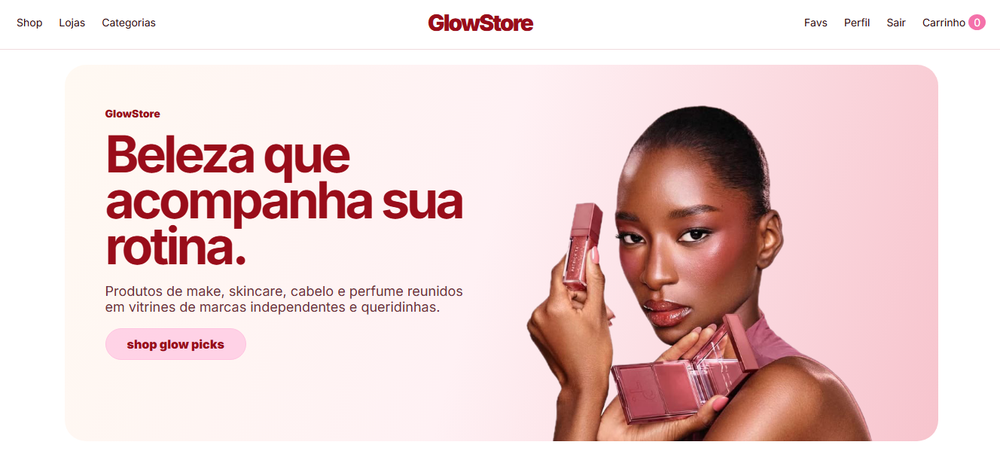

# GlowStore — E-commerce de Beleza com Design Patterns

GlowStore é uma aplicação web em Django que simula um marketplace de beleza. A proposta é reunir lojas e marcas de maquiagem, skincare, cabelo, perfume e cuidados pessoais em uma experiência de compra clean, feminina e sofisticada.

## Problema:

No mercado de beleza, produtos costumam ficar espalhados em sites diferentes. A GlowStore resolve isso criando um espaço único onde várias lojas podem ter suas próprias vitrines, enquanto o cliente consegue navegar por categorias, favoritar produtos/lojas, adicionar itens ao carrinho e finalizar uma compra.

## Padrões de Projeto utilizados:

### 1. Singleton — `CartSession`

Arquivo: `store/patterns.py`

Garante uma única instância do carrinho por request. Ele centraliza o carrinho salvo na sessão do usuário.

Benefício: evita espalhar lógica de carrinho pelas views.

### 2. Factory — `PaymentStrategyFactory`

Arquivo: `store/patterns.py`

Cria dinamicamente a estratégia de pagamento correta: Pix, Cartão ou Glow Club.

Benefício: novas formas de pagamento podem ser adicionadas sem alterar o checkout inteiro.

### 3. Strategy — `PaymentStrategy` e `ShippingStrategy`

Arquivo: `store/patterns.py`

Cada método de pagamento e entrega possui sua própria regra de cálculo.

Exemplos:

- Pix aplica 5% de desconto.
- Glow Club aplica 10% de desconto.
- Entrega padrão é grátis acima de R$180.
- Entrega expressa tem taxa fixa.

Benefício: regras variam sem quebrar o fluxo principal.

### 4. Builder — `OrderBuilder`

Arquivo: `store/patterns.py`

Monta o pedido passo a passo: cliente, carrinho, pagamento, entrega e totais.

Benefício: criação do pedido fica organizada e legível.

### 5. Facade — `CheckoutFacade`

Arquivo: `store/patterns.py`

Simplifica o checkout inteiro. A view chama a fachada e ela coordena carrinho, cálculo, criação do pedido, itens e notificações.

Benefício: a view fica limpa e a lógica complexa fica centralizada.

### 6. Observer — `OrderSubject`, `StockObserver`, `DashboardObserver`

Arquivo: `store/patterns.py`

Quando um pedido é criado, observadores são notificados. Um atualiza o status para pago e outro reduz o estoque dos produtos.

Benefício: novas reações ao pedido podem ser adicionadas sem alterar o checkout.

### 7. Command — `AddToCartCommand`, `ToggleFavoriteProductCommand`, `ToggleFavoriteStoreCommand`

Arquivo: `store/patterns.py`

Encapsula ações da interface como adicionar ao carrinho e favoritar.

Benefício: ações ficam reutilizáveis, testáveis e separadas das views.

## Como rodar

Clonar o Repositório:

```bash
git clone https://github.com/anacgsx/GlowStore.git
cd glowstore
```

Criar ambiente virtual:

```bash
python -m venv venv
```

Windows PowerShell:

```bash
.\venv\Scripts\activate
```

Linux/Mac:

```bash
source venv/bin/activate
```

Instale as dependências:

```bash
pip install -r requirements.txt
```

Rode as migrações:

```bash
python manage.py makemigrations
python manage.py migrate
```

Popule com dados de exemplo:

```bash
python manage.py seed_glowstore
```

Crie um usuário administrador, se quiser acessar o admin:

```bash
python manage.py createsuperuser
```

Inicie o servidor:

```bash
python manage.py runserver
```

Acesse:

```text
http://127.0.0.1:8000/
```
Admin:

```text
http://127.0.0.1:8000/admin
```
## Preview da Página Inicial

<p align="center">
  
</p>